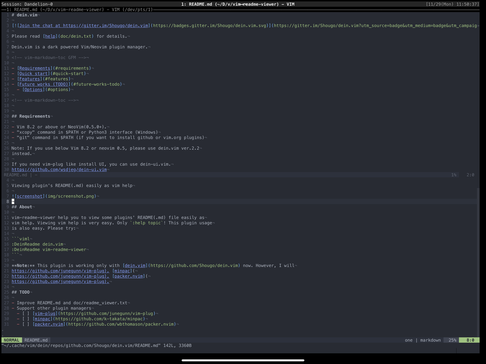

# vim-readme-viewer

Please read [help](doc/readme_viewer.txt) for details.

Viewing plugin's README(.md) easily as vim help



## About

vim-readme-viewer help you to view some plugins' README(.md) file easily as
vim help. Viewing vim help is very easy. Only `:help topic`! This plugin usage
is also easy. Please try:

```viml
:DeinReadme dein.vim
:DeinReadme vim-readme-viewer
```

**Note:** This plugin is working with [dein.vim](https://github.com/Shougo/dein.vim),
[vim-plug](https://github.com/junegunn/vim-plug) and [minpac](
https://github.com/k-takata/minpac) now. I will supprt [packer.nvim](
https://github.com/wbthomason/packer.nvim).

## TODO

- Improve README.md and doc/readme_viewer.txt
- Support other plugin managers
  - [x] [dein.vim](https://github.com/Shougo/dein.vim)
  - [x] [vim-plug](https://github.com/junegunn/vim-plug)
  - [x] [minpac](https://github.com/k-takata/minpac)
  - [ ] [packer.nvim](https://github.com/wbthomason/packer.nvim)
