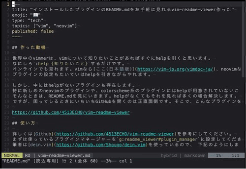

# vim-readme-viewer

Please read [help](doc/readme_viewer.txt) for details.

> 📖 Viewing plugin's README easily like vim help



<!--ts-->
* [vim-readme-viewer](#vim-readme-viewer)
   * [About](#about)
   * [Why use this?](#why-use-this)
   * [Installation](#installation)
      * [<a href="https://github.com/Shougo/dein.vim">dein.vim</a>](#deinvim)
      * [<a href="https://github.com/junegunn/vim-plug">vim-plug</a>](#vim-plug)
      * [<a href="https://github.com/k-takata/minpac">minpac</a>](#minpac)
      * [<a href="https://github.com/wbthomason/packer.nvim">packer.nvim</a>](#packernvim)
   * [Tips](#tips)
      * [General](#general)
      * [vim-plug](#vim-plug-1)
      * [packer.nvim](#packernvim-1)
   * [TODO](#todo)
   * [Introduced Articles](#introduced-articles)
   * [License](#license)
<!--te-->

Created by [gh-md-toc](https://github.com/ekalinin/github-markdown-toc)

## About

vim-readme-viewer help you to view some installed plugins' README(.md) file
easily like vim help file. Viewing vim help file is very easy. Only
`:help {topic}`! This plugin usage is also easy. If you are using
[dein.vim](https://github.com/Shougo/dein.vim), please try:

```vim
:DeinReadme dein.vim
:DeinReadme vim-readme-viewer
" ... and other plugins
```

If you are using other plugin managers, please try:

```vim
:PlugReadme vim-readme-viewer  " for vim-plug
:PackReadme vim-readme-viewer  " for minpac
:PackerReadme vim-readme-viewer  " for packer.nvim
" ... and other plugins
```

**Note:** This plugin is working with
[dein.vim](https://github.com/Shougo/dein.vim),
[vim-plug](https://github.com/junegunn/vim-plug),
[minpac](https://github.com/k-takata/minpac) and
[packer.nvim](https://github.com/wbthomason/packer.nvim) now.

## Why use this?

Vim help file is very useful and viewing it is very easy. However, some plugins,
which is special such as colorschemes or tiny plugins, sometimes don't have vim
help file. So, when you want to custom those plugins, you have to read README.md
or look at plugins' inside code. It is not good for you because you have to do
it outside vim.

## Installation

### [dein.vim](https://github.com/Shougo/dein.vim)

with vim script:

```vim
let g:readme_viewer#plugin_manager = 'dein.vim'
call dein#add('4513ECHO/vim-readme-viewer', {'on_cmd': 'DeinReadme'})
```

with toml:

```toml
[[plugins]]
repo = '4513ECHO/vim-readme-viewer'
on_cmd = ['DeinReadme']
hook_add = '''
let g:readme_viewer#plugin_manager = 'dein.vim'
'''
```

### [vim-plug](https://github.com/junegunn/vim-plug)

```vim
let g:readme_viewer#plugin_manager = 'vim-plug'
Plug '4513ECHO/vim-readme-viewer', { 'on': 'PlugReadme' }
```

### [minpac](https://github.com/k-takata/minpac)

```vim
let g:readme_viewer#plugin_manager = 'minpac'
call minpac#add('4513ECHO/vim-readme-viewer')
```

### [packer.nvim](https://github.com/wbthomason/packer.nvim)

```lua
vim.g['readme_viewer#plugin_manager'] = 'packer.nvim'
use { '4513ECHO/vim-readme-viewer', opt = true, cmd = 'PackerReadme' }
```

## Tips

### General

Basically vim-readme-viewer automatically judge your using plugin manager.
However, it sometimes may fail. I recommend that you set manually
`g:readme_viewer#plugin_manager` to plugin manager.

```vim
let g:readme_viewer#plugin_manager = 'vim-plug'  " for vim-plug
let g:readme_viewer#plugin_manager = 'minpac'  " for minpac
```

### vim-plug

On default, vim-plug is not register itself as a plugin. So, vim-readme-viewer
cannot open vim-plug's README.md. If you want to view vim-plug's README.md, you
register vim-plug as a plugin.

```vim
Plug 'junegunn/vim-plug'
```

### packer.nvim

`:PackerReadme` require that executing `:PackerCompile`. If you don't execute
it, `vim-readme-viewer` throws error.

## TODO

- Improve README.md and doc/readme_viewer.txt
- Support other plugin managers
  - [ ] runtimepath based plugin manager
  - [ ] buildin package system based plugin manager
  - [x] [dein.vim](https://github.com/Shougo/dein.vim)
  - [x] [vim-plug](https://github.com/junegunn/vim-plug)
  - [x] [minpac](https://github.com/k-takata/minpac)
  - [x] [packer.nvim](https://github.com/wbthomason/packer.nvim)

## Introduced Articles

If you wrote an article about the plugin, please send me Pull-Request 😃

- [インストールしたプラグインのREADME.mdをお手軽に見れるvim-readme-viewer作った](https://zenn.dev/4513echo/articles/2021-12-04-vim-readme-viewer)
  (Japanese)
- [vim-readme-viewerの対象をfzfで選択するコマンドを作った](https://zenn.dev/kawarimidoll/articles/316023e5b61d00)
  (Japanese)

## License

MIT License
